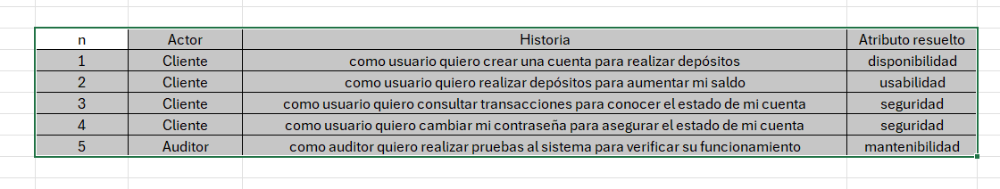

# Laboratorio-3-DOSW
Project for lab03

##  Reglas de Negocio

<h4> Formato de número de cuenta: </h4>

- No puede contener letras ni caracteres especiales.
- Debe tener exactamente 10 dígitos numéricos.

<h4> Validación del banco:</h4>

- Los dos primeros dígitos del número de cuenta representan el código del banco.
- Solo se aceptan cuentas cuyos códigos de banco estén previamente registrados en el sistema.

<h4> Validación de cuenta al crearla: </h4>

- No se puede crear una cuenta si el número no cumple las reglas .

- Cada cuenta debe ser única.

<h4> Depósitos </h4>

- Solo se pueden hacer depósitos a cuentas existentes y válidas.

- No se pueden hacer depósitos de montos negativos o cero.

<h4> Consulta de saldo </h4>

- Solo se puede consultar el saldo de una cuenta si esta existe y es válida.

##  Funcionalidades Principales

- Crear una cuenta bancaria

- Validar formato del número de cuenta.

- Verificar si el código del banco es válido.

- Almacenar la cuenta con un saldo inicial (posiblemente cero).

- Validar número de cuenta

- Confirmar si un número de cuenta cumple las reglas de formato y banco.

- Consultar saldo

- Retornar el saldo actual de una cuenta.

- Realizar depósito

- Agregar una cantidad válida al saldo de una cuenta existente.

- Registrar banco válido.

- Agregar un nuevo banco con su código .

## Actores Principales

<h4>Cliente</h4>

Crea cuentas, consulta saldo, realiza depósitos.

<h4>Administrador del sistema </h4>

Registra bancos válidos en el sistema.

<h4>Sistema de validacion</h4>

Procesar reglas de negocio y operaciones de cuentas.

<h4>Auditor</h4>

Ejecutar pruebas unitarias (TDD), verifica cobertura (JaCoCo), y revisa calidad del código (SonarQube).

## Precondiciones del Sistema

- Registro inicial de bancos válidos

- Entorno de pruebas y CI configurado

- Control de autenticación 

## Diagrama de casos de uso
.png)

## Historias de usuario
<h4> Cliente </h4>

- Como usuario quiero crear una cuenta para realizar depósitos
- Como usuario quiero realizar depósitos para aumentar mi saldo
- Como usuario quiero consultar datos para conocer el estado de mi cuenta

<h4> administrador </h4>

- Como administrador quiero administrar el sistema para asegurar el correcto funcionamiento
- Como administrador quiero registrar los bancos para aumentar la cobertura del sistema

